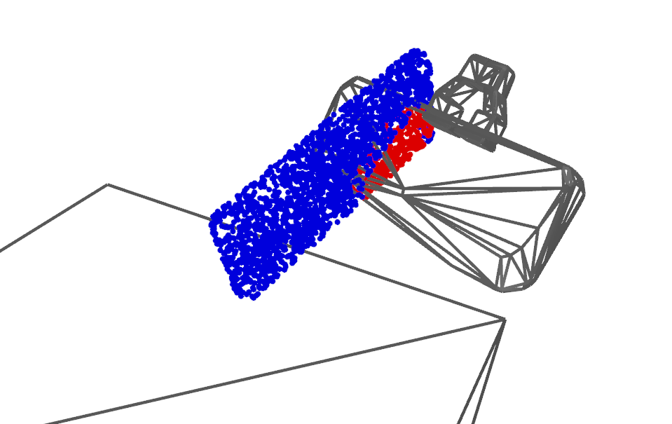

# Contact-based Representation Pre-training Dataset

Before running the data generation pipeline, ensure the assets setup has been completed according to the [main README](../../../../README.md).

## Downloading the Pretraining Data  

You can download and extract the pretraining data that we make available [here](https://huggingface.co/imm-unicorn/corn-public/blob/main/col-12-2048.tar.gz).

To download and use the data, run the following inside the docker container:

```bash
cd /tmp/
wget https://huggingface.co/imm-unicorn/corn-public/resolve/main/col-12-2048.tar.gz
tar -xzf col-12-2048.tar.gz
```

In case you'd like to generate your own data, we also make the data generation pipeline available
in the lowermost section.

## Data Visualization

To validate whether the generated dataset looks good, you can run:

```bash
python3 show_dataset.py
```

This should result in a visualization window that looks like the following:



Which shows the red points marked as in-colliison and blue points marked as collision-free.

If the resulting image does not immediately look as in the figure, try pressing `w` which toggles wireframe mode.

## (Optional) Data Generation

Inspect the content of [gen_col.py](./gen_col.py) if it meets the requirements of your system.

For instance, by default we use cuda device 0 for data generation, and use an NVIDIA A6000 GPU for data generation.
Depending on your hardware, you may need to restart your process to circumvent OOM issues arising from accumulation of torch memory cache.

Afterward, run [gen_col.py](./gen_col.py) to generate pretraining data.
By default, the pretraining data are stored in `/tmp/col-12-2048`.


After generating (or extracting) the data, the expected directory structure would look as follows:

```bash
$ tree -L 2 /tmp/col-12-2048 | head -n 10
/tmp/col-12-2048
|-- 000000.pkl
|-- 000001.pkl
|-- 000002.pkl
|-- 000003.pkl
|-- 000004.pkl
|-- 000005.pkl
|-- 000006.pkl
|-- 000007.pkl
|-- 000008.pkl
```

