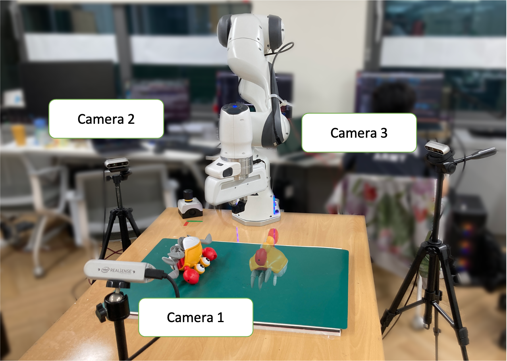

# Scripts for real-robot deployment

---

## Overview

Our real-world experimental setup looks as below:



We mount 3x Realsense D435 cameras around the Franka Emika Panda robot arm, on which the gripper is wrapped with a rubber glove.

To facilitate our heuristic for color-based segmentation, we place a green mat over the robot workspace in range `x=[0.25m,0.75m]` and `y=[-0.3m,+0.3m]` in the robot frame.

## Package Setup

Refer again to the [Dockerfile](../../../docker/Dockerfile) for our environment and package dependencies.

For real-world deployment, we additionally require [polymetis](https://facebookresearch.github.io/fairo/polymetis/), which can
be installed by following the instructions in the [linked page](https://facebookresearch.github.io/fairo/polymetis/installation.html).

## Calibration

Calibrate the cameras and robot extrinsics, which generates the following files in the `${PKM_RUNTIME_DIR}` directory:

```
$ python3 collect_calibration_data.py # -> ${PKM_RUNTIME_DIR}/pq_list.pkl
$ python3 calibrate_transforms.py # -> ${PKM_RUNTIME_DIR}/transforms.pkl
$ python3 multi_cam_calibration.py # -> ${PKM_RUNTIME_DIR}/extrinsics.pkl
```

### Calibrate color-based segmentation algorithm parameters

```bash
$ python3 tune_hsv_threshold.py
```

This generates the `${PKM_RUNTIME_DIR}/table_color.pkl`, which is required for color-based background segmentation.

### Calibrate object-specific april tag tracker

Our perception stack optionally utilizes april-tag based object tracking system.

If you would like to use this feature, then calibrate the object-specific april tag tracker as follows:

```bash
$ python3 print_april_tag_ids.py object=${OBJECT} tag_size=${TAG_SIZE}
$ python3 calibrate_multicam_april_tag_tracker.py object=${OBJECT} tag_size=${TAG_SIZE}
```

Here, `${OBJECT}` can be any unique id that you assign for a particular object, and `tag_size` is the 
size of the (default) 36h11 april-tag that has been pasted on the object.

## Experiment Setup

### Task configuration generation

To evaluate the policies, sample a set of goal poses in the real-world:

```bash
$ python3 sample_goal_pose.py # -> ${PKM_RUNTIME_DIR}/task{index:04d}.pkl
```

## Policy Deployment

Running the policy requires the following files (generated in the above steps)

* `${PKM_RUNTIME_DIR}/extrinsics.pkl`
* `${PKM_RUNTIME_DIR}/task*.pkl`

By default, the latest transforms/extrinsics/task files are selected.


After the above configuration steps have been completed, execute the policy by running the controller:

```
$ python3 controller.py -ckpt ${STUDENT_CKPT} -dagger -obj ${OBJ} -april 0
```

where `${STUDENT_CKPT}` should be replaced with the result from the distillation pipeline,
and the `${OBJ}` refers to the object to test. If you have already calibrated
your object in the above step, you may also want to toggle `-april 1` instead.

## Extras & Tools

We offer a set of additional tools to work with the real world experiments.

### Test perception stack

To run the perception stack independently, without running the controller:

```
$ python3 test_perception.py
```

### Replay logs

To see the saved logs from a previous execution, run:

```
$ python3 replay_log.py path="${LOG_PATH}"
```

To test controlling the franka panda robot with a joystick (e.g. to test the connection):

```
$ python3 joystick_controller.py
```
