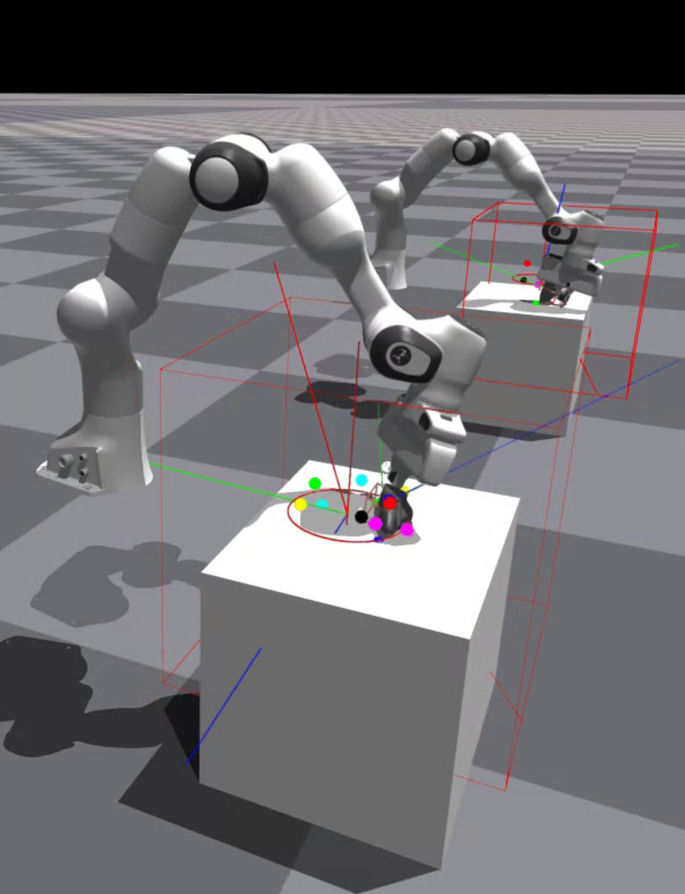

# Nonprehenesile Manipulation Policy Training in a GPU Simulation

## Loading and Running a Pretrained Policy

To run our pretrained policy in a simulation, run the following:

```bash
PYTORCH_JIT=0 python3 show_ppo_arm.py +platform=debug +env=icra_base +run=icra_ours ++env.seed=56081 ++tag=policy ++global_device=cuda:0 ++path.root=/tmp/pkm/ppo-a ++icp_obs.icp.ckpt=imm-unicorn/corn-public:512-32-balanced-SAM-wd-5e-05-920 ++load_ckpt=imm-unicorn/corn-public:dr-icra_base-icra_ours-ours-final-000042 ++env.num_env=16
```

**Note**: You may have to setup display following [Instruction](#extra-tips) for visualization.

In case you'd like to dive deeper, we also include documentation about training the policy yourself in the below sections.

## Policy Training

If you'd like to train the policy yourself, you may run the training script as follows:

```bash
PYTORCH_JIT=0 python3 train_ppo_arm.py +platform=debug +env=icra_base +run=icra_ours ++env.seed=56081 ++tag=policy ++global_device=cuda:0 ++path.root=/tmp/pkm/ppo-a ++icp_obs.icp.ckpt="${CORN_CKPT}"
```

Replace `${CORN_CKPT}` with the name of the pretrained _representation_ model (as in [pretraining](../pretrain/README.md)) that you have trained or downloaded.

Alternatively, you may use `CORN_CKPT=imm-unicorn/corn-public:512-32-balanced-SAM-wd-5e-05-920` to use our pretrained weights.

If the training run results in an error, you may need to run:
```bash
sudo chmod -R 777 /home/user/.cache/
```

By default, the results of the training will be stored in `/tmp/pkm/ppo-a/run-{:03d}`.

In general, we disable JIT for the purposes of the current code release, as its stability depends on your hardware.
In the case that your particular GPU+docker setup supports JIT compilation, you may enable `torch.jit.script()` as follows:
```bash
PYTORCH_JIT=1 python3 ...
```

## Policy Evaluation

```bash
PYTORCH_JIT=0 python3 show_ppo_arm.py +platform=debug +env=icra_base +run=icra_ours ++env.seed=56081 ++tag=policy ++global_device=cuda:0 ++path.root=/tmp/pkm/ppo-a ++icp_obs.icp.ckpt="${CORN_CKPT}" ++load_ckpt="${POLICY_CKPT}" ++env.num_env=1
```
Replace `${POLICY_CKPT}` with the name of the policy that you have trained or downloaded.

Alternatively, you may use `POLICY_CKPT=imm-unicorn/corn-public:dr-icra_base-icra_ours-ours-final-000042` to use our pretrained weights.

By default, we disable JIT for the purposes of the current code release.
In the case that your particular GPU+docker setup supports JIT compilation, you may enable `torch.jit.script()` as follows:
```bash
PYTORCH_JIT=1 python3 ...
```

Assuming all goes well, you should see an image like this:



To enable graphics rendering, see [extra tips](#extra-tips).


## Sim2real Teacher-Student Distillation

To distill the privileged teacher to the student, first run the second phase of policy fine-tuning to reduce the action-space:

```bash
PYTORCH_JIT=0 python3 train_ppo_arm.py +platform=debug +env=icra_base +run=icra_ours ++env.seed=56081 ++tag=student ++global_device=cuda:0 ++path.root=/tmp/pkm/ppo-a ++env.num_env=8192 ++is_phase2=true ++phase2.min_reset_to_update=65536 ++agent.train.lr=2e-6 ++agent.train.alr.initial_scale=6.67e-3 ++icp_obs.icp.ckpt="${CORN_CKPT}"  ++load_ckpt="${POLICY_CKPT}"
```

Afterward, run the distillation script as follows:

```bash
PYTORCH_JIT=0 python3 train_rma.py +platform=debug +env=icra_base_rma_mc +run=icra_ours +student=rma_gru_student_base_v2 ++env.seed=56081 ++env.num_env=2048 ++tag=dagger ++global_device=cuda:0 ++path.root=/tmp/pkm/rma ++icp_obs.icp.ckpt="${CORN_CKPT}"  ++load_ckpt="${POLICY_CKPT}" ++train_student_policy=0 ++dagger=true ++is_phase2=true ++dagger_train_env.deterministic_action=false ++phase2.start_dof_pos_offset=0.03 ++phase2.adaptive_residual_scale=false ++env.franka.max_pos=0.06 ++env.franka.max_ori=0.1
```

As before, replace `${POLICY_CKPT}` and `${CORN_CKPT}` as necessary.

## Extra Tips

To enable the visualization during [policy training](#policy-training) or [policy evaluation](#policy-evaluation), you may need to add `++env.use_viewer=1` to the command line arguments.

Note that this will slow down the training process, so it's generally not recommended - only for debugging.

In case the visualization window does not start, ensure that the `${DISPLAY}` environment variable is configured to match that of the host system, which can be checked by running:
```bash
echo $DISPLAY
```
_outside_ of the docker container, i.e. in your _host_ system. Then, _inside_ the docker container:

```bash
export $DISPLAY=...
```
so that it matches the output of the earlier command (`$echo ${DISPLAY}`) in your host system.

## Experiment Tracking & API Setup

While the models and training progressions are also stored locally, You may track our model progress via [WanDB](https://wandb.ai/) and store the pretrained models with [HuggingFace](https://huggingface.co/).
To configure both APIs, run `wandb login` / `huggingface-cli login`.

Afterward, you can replace the `+platform=debug` directive in the command line with `+platform=dr`.

## Troubleshooting

In the case that a prior `jit` compilation has failed, it may be necessary to clear the jit cache:

```
rm -rf ~/.cache/torch_extensions
```

## Details about CLI options

When running the training (`train_ppo_arm.py`) or evaluation (`show_ppo_arm.py`) scripts, we use a number of CLI options to configure the runs. We describe details about those options here:

* `+platform` configures the training run depending on your hardware; by default we use `debug` which disables WanDB logging.
* `+env` refers to the environment configuration such as the object set and domain randomization parameters. (by default, we load `icra_base` which can be inspected [here](../../src/pkm/data/cfg/env/icra_base.yaml) which matches the hyperparameters in the paper.)
* `+run` refers to the policy configuration (by default, we load `icra_ours` which can be inspected [here](../../src/pkm/data/cfg/run/icra_ours.yaml) which matches hyperparameters as in the paper.)
* `++env.seed` overrides the RNG seeds that controls domain randomization.
* `++env.num_env` overrides the number of environments to simulate in parallel.
* `++global_device`, formatted as `cuda:{INDEX}`, configures the GPU device on which the simulation and training will be run.
* `++path.root` configures the local directory to which the run logs and weights will be saved.
* `++icp_obs.icp.ckpt` configures the pretrained weights of the _representation model_. It may point to a local path or to a huggingface repository formatted as `entity/repository:filename`.
* `++load_ckpt` loads the pretrained weights of the _policy_. Like `icp_obs.icp.ckpt`, it may point to a local path or to a huggingface repository formatted as `entity/repository:filename`.
* `++tag` sets the run tag for remote logging in `wandb`.
